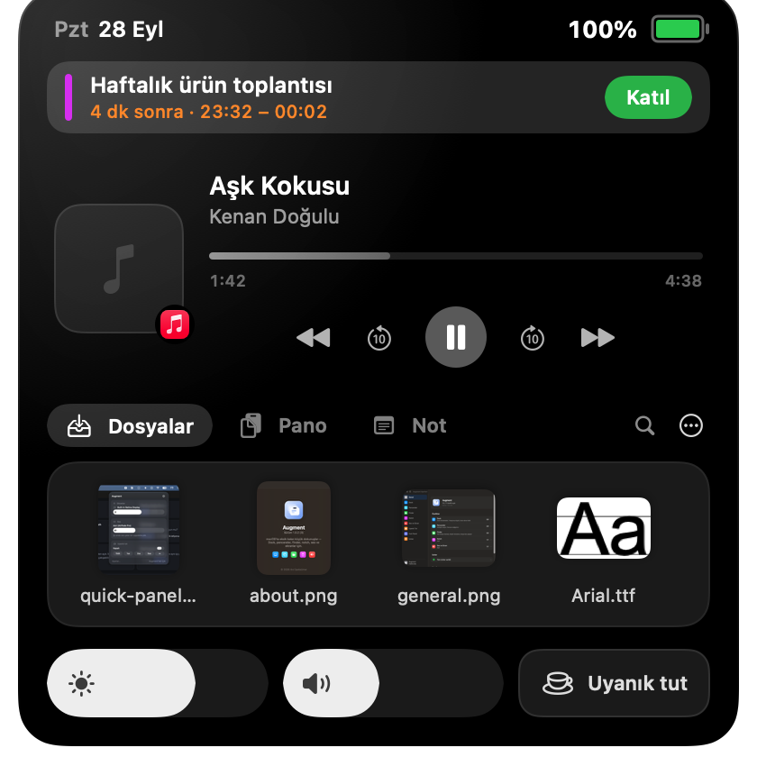
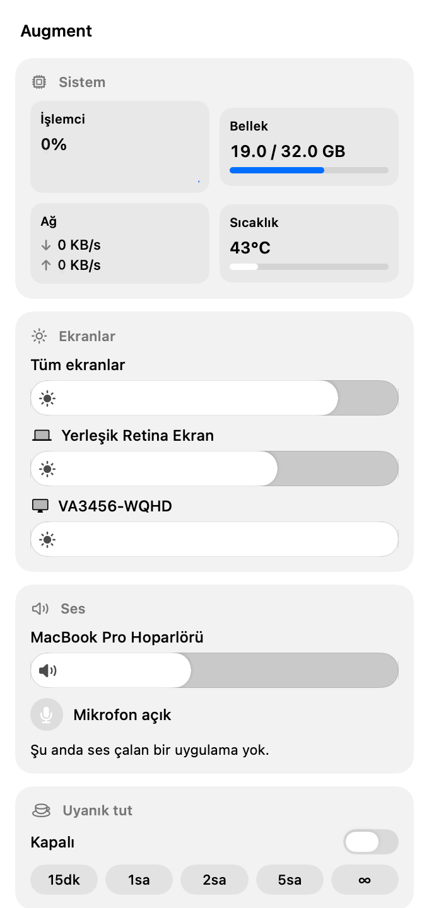
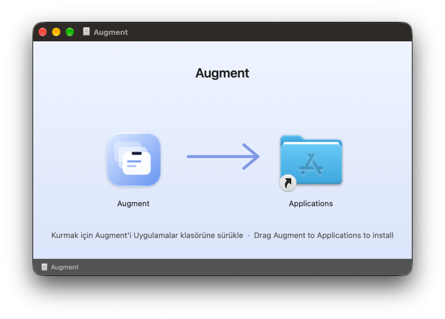

<p align="center">
  
</p>

<h1 align="center">Augment</h1>

<p align="center">
  A minimalist macOS utility designed to elevate your desktop experience with a native aesthetic.
</p>

<p align="center">
  
  
  
  
</p>

---

Augment fills in the small things macOS leaves out — for the Dock, windows, Finder, the notch, sound and displays — in a design that feels like part of the system: Liquid Glass surfaces, System Settings–style preferences, light and dark mode.

**Everything starts switched off.** Turn on what you want; Augment asks for a permission only at the moment a feature actually needs it.

<p align="center">
  
  &nbsp;&nbsp;
  
</p>

## Features

### The notch
Move the pointer to the notch (or the top-center of any screen):
- **Now Playing** — artwork, progress and controls for Music, Spotify and browser media, with the colour of the artwork glowing through.
- **File shelf** — drop files to keep them at hand, with real thumbnails and **Quick Look**. Drag files onto the notch to **keep them, AirDrop them or zip them** in one move.
- **Clipboard, Note & Pomodoro** — recent copies with previews, a quick note, and a focus timer with an adjustable length.
- **Mirror** — a mirrored camera preview to check yourself before a call (camera on only while the tab is open).
- **Upcoming meetings** — your next event, and five minutes before it starts the notch opens with a **Join** button for Zoom, Meet and Teams links.
- **Screenshots to the shelf** — new screenshots land on the shelf, ready to drag into a chat.
- **Brightness, volume and Keep Awake** right in the notch.

### Quick panel (menu bar)
Click Augment's menu bar icon — right-click for its menu:
- **System** — CPU with a live graph, memory, network speed and chip temperature.
- **Displays** — brightness for every screen: the built-in panel and Apple displays natively, other monitors over **DDC/CI**, software dimming as a fallback.
- **Sound** — output volume, **per-app volume and per-app output device**, microphone mute.
- **Keep Awake** — until you turn it off or for 15 min – 5 h.

### Displays
- The keyboard's **brightness and volume keys control the monitor under the pointer** (MonitorControl-style), with an on-screen level indicator.
- **Day / night brightness** schedule that fades between levels.
- Built-in brightness glides the way the macOS keys do.

### Keep Awake (Amphetamine-style)
- Manual or timed sessions.
- Automatically **while chosen apps are open, while on power, or while a download is in progress**.
- Let the display sleep while the Mac keeps working; stay awake with the lid closed (on power).

### Sound
- **Volume mixer** — per-app volume and mute using Core Audio process taps (macOS 14.2+).
- **Per-app output** — send one app to the speakers and another to your AirPods.
- Pause playback when headphones are removed.

### Dock & windows
- **Dock previews** — live window thumbnails on hover, including minimized windows, with close / minimize / zoom controls.
- **Click to minimize** a frontmost app's windows from its Dock icon, and **Dock lock** to a chosen screen.
- **⌥Tab switcher** with thumbnails — every window and every open app, Liquid Glass, keyboard and mouse.
- **Snapping** with ⌘ + arrow keys and a **layout picker** (⌃⌥Space).

### Finder
- Right-click › **New File / Folder** from templates (code, Office, data, text).
- **Copy Path** and **Open in Terminal** — also available under *Services*, so they work in iCloud Drive and an iCloud-synced Desktop.
- A real **Cut (⌘X) → Paste (⌘V)** with a badge on cut items and **⌘Z to undo** the move.
- **Folder Quick Look** — press Space on a folder to see its contents as a tree.

### Productivity
- **Clipboard panel (⇧⌘V)** — search your history, pin favourites, paste with Return or ⌘1–⌘9.

<p align="center">
  
</p>

## Installation

1. Download the latest **`Augment-x.y.z.dmg`** from [Releases](https://github.com/anilipeksumer/Augment_MacOS/releases).
2. Open it and drag **Augment** into **Applications**.
3. Launch Augment from Applications. A short tour appears, then Settings.

The app is signed with a Developer ID and notarized by Apple.

<p align="center">
  
</p>

### Permissions
Requested only when you switch on a feature that needs them:

| Permission | Used by |
| --- | --- |
| Accessibility | Dock previews & click, window switcher, snapping, layouts, Finder cut, display keys, clipboard panel |
| Screen & System Audio Recording | Window thumbnails; the volume mixer (system audio only) |
| Automation → Finder | Finder cut & paste |
| Calendars | Upcoming meetings |
| Camera | Mirror |

### Finder extension
The right-click items come from Augment's Finder extension, which **macOS installs switched off**. Augment shows its state on the Finder settings page with a button that opens the right place in System Settings (*General › Login Items & Extensions › Finder*). macOS doesn't consult Finder extensions inside iCloud folders — the *Services* versions of Copy Path, Open in Terminal and New Text File cover those.

## Building from source

Requirements: Xcode 26 or later.

```bash
git clone https://github.com/anilipeksumer/Augment_MacOS.git
cd Augment_MacOS
open Augment.xcodeproj
```

Build and run the **Augment** scheme. The project has three targets:

| Target | What it is |
| --- | --- |
| `Augment` | The menu bar app (not sandboxed — it needs Accessibility, event taps and Core Audio taps). |
| `AugmentFinder` | Finder Sync extension — right-click menu and the cut badge. |
| `AugmentQL` | Quick Look extension for folders. |

The app and its extensions share settings through a small plist in `~/Library/Application Support/Augment/Shared/`.

### Tests
Augment has a built-in functional test runner that drives features the way a user would and writes results to `~/Library/Application Support/Augment/functest.log`:

```bash
open -n /Applications/Augment.app --args --functest            # full suite (moves the mouse, uses the keyboard)
open -g -n /Applications/Augment.app --args --functest --extras  # non-interactive checks
```

## Privacy
Augment works entirely on your Mac. It has no analytics or accounts and sends nothing about you anywhere. The only network requests download album artwork for what's playing (for example Spotify or a browser video's thumbnail).

## Credits
Made by **Anıl İpeksümer**.
