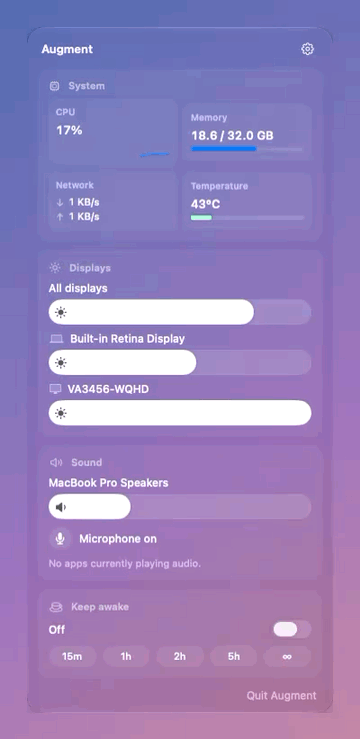
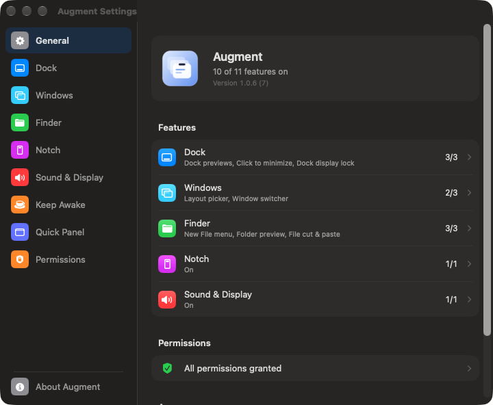

  

<h1 align="center">Augment</h1>

  <b>A minimalist macOS utility designed to elevate your desktop experience with a native aesthetic.</b>

  

  
  
  

  

---

The notch, the menu bar, the Dock, your windows and Finder — the everyday places macOS leaves a little unfinished. Augment fills those gaps with Liquid Glass surfaces and settings that feel like they came with the system.

- **Native, not bolted on.** Glass panels, System Settings–style preferences, light and dark mode.
- **Off until you want it.** Every feature starts switched off; a permission is asked for only when a feature needs it.
- **Private.** No accounts, no analytics — everything happens on your Mac.

## The notch, put to work

Move the pointer to the notch and it opens into a small control center.

- **Now Playing** for Music, Spotify and browser media, tinted by the artwork.
- **File shelf** with real thumbnails and Quick Look — drop files on the notch to keep them, **AirDrop** them or **zip** them.
- **Clipboard, Note and Pomodoro** a click away, plus a **Mirror** to check yourself before a call.
- **Upcoming meeting** with a **Join** button, five minutes before it starts.
- **Screenshots** land on the shelf automatically.
- Brightness, volume and **Keep Awake** at the bottom.

<table>
<tr>
<td width="55%" valign="top">

## Everything else, one click away

Click Augment in the menu bar:

- **System** — CPU with a live graph, memory, network, chip temperature.
- **Displays** — brightness for every screen, including external monitors over DDC/CI.
- **Sound** — output volume, **volume per app**, and **which speaker each app plays on**.
- **Microphone** mute and **Keep Awake** with durations.

</td>
<td width="45%" align="center">
  
</td>
</tr>
</table>

## Windows & Dock

- **Show Desktop** — enable it in Settings → Windows, then press ⌘D, Option-click Augment in the menu bar, or use the quick panel button. Repeat to restore your windows; no extra permission needed.

- **Dock previews** — hover an icon to see its windows, minimized ones included; close, minimize or zoom right there.
- **⌥Tab switcher** with live thumbnails of every window and every open app.
- **Snap** windows with ⌘ + arrow keys, or pick a layout with ⌃⌥Space.
- **Click to minimize** from the Dock, and keep the Dock on the screen you choose.

## Finder

- Right-click › **New File or Folder** from templates — code, Office documents, data, text.
- **Copy Path** and **Open in Terminal**, in iCloud folders too.
- A real **Cut ⌘X / Paste ⌘V** for files, with **⌘Z** to put them back.
- Press Space on a **folder** to preview what's inside.

## Displays, sound & staying awake

- Your keyboard's **brightness and volume keys work on external monitors** — whichever screen the pointer is on.
- **Day and night brightness** that fades on schedule.
- **Keep Awake** like Amphetamine: for a while, while certain apps are open, on power, or until a download finishes — even with the lid closed on power.
- **Pause music when headphones are removed**, even while the mixer is in use.
- **Clipboard history** with search and pins — ⇧⌘V.

<b>All features</b>

| Area | Feature |
| --- | --- |
| Notch | Now Playing, file shelf with Quick Look, drop to shelf / AirDrop / zip, clipboard, quick note, Pomodoro (adjustable), mirror, upcoming meetings, screenshots to shelf, brightness, volume, Keep Awake, calendar & battery styles |
| Quick panel | System stats, per-display brightness, all-displays slider, output volume, per-app volume & output, microphone, meetings, Keep Awake — each section can be hidden |
| Displays | Native / DDC/CI / software brightness, brightness & volume keys on monitors, on-screen level indicator, day/night schedule |
| Sound | Volume mixer (macOS 14.2+), per-app output device, pause on headphone removal |
| Keep Awake | Manual, timed, while apps run, on power, while downloading; display may sleep; lid closed on power |
| Dock | Window previews (incl. minimized), window controls, click to minimize, Dock lock to a screen |
| Windows | ⌥Tab switcher, ⌘-arrow snapping, layout picker |
| Finder | New file & folder templates, Copy Path, Open in Terminal (menu + Services), Cut & Paste with undo, folder Quick Look |
| Clipboard | History panel with search, pins, ⌘1–⌘9 |

  

## Install

1. [Download the latest release](https://github.com/anilipeksumer/Augment_MacOS/releases/latest) (`Augment-x.y.z.dmg`).
2. Open it and drag **Augment** into **Applications**.
3. Open Augment. A short tour shows you around, then Settings opens — switch on what you like.

Augment is signed with a Developer ID and notarized by Apple.

## FAQ

<b>Why does Augment ask for permissions?</b>

Only the features you switch on ask, and only for what they need:

| Permission | For |
| --- | --- |
| Accessibility | Dock previews and clicks, window switcher, snapping, layouts, Finder cut & paste, display keys, clipboard panel |
| Screen & System Audio Recording | Window thumbnails; the volume mixer |
| Automation → Finder | Finder cut & paste |
| Calendars | Upcoming meetings |
| Camera | Mirror |

<b>The right-click items don't show up in Finder.</b>

macOS installs Finder extensions switched off. Open Augment's **Finder** settings and click **Turn On…** — it takes you to the right place in System Settings. Inside **iCloud Drive** or an iCloud-synced Desktop/Documents, macOS doesn't show extension items at all; use right-click › **Services** there instead.

<b>Does it work with my external monitor?</b>

Most monitors support DDC/CI, which Augment uses for brightness and speaker volume. If yours doesn't, Augment dims the picture in software instead. Apple displays and the built-in screen use macOS's own brightness.

<b>How do I uninstall it?</b>

Quit Augment (right-click the menu bar icon › Quit), then move it from Applications to the Trash. Its settings live in `~/Library/Application Support/Augment`.

## Requirements

macOS 13 Ventura or later on Apple Silicon or Intel. The volume mixer needs macOS 14.2 or later.

## For developers

See [BUILDING.md](BUILDING.md) to build from source and run the tests.

## License

Copyright © 2026 Anıl İpeksümer. All rights reserved — see [LICENSE](LICENSE). Augment is free to download and use.
